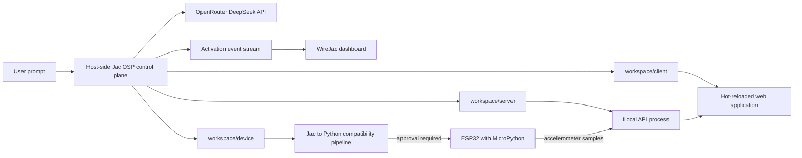
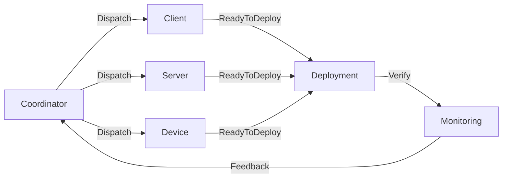
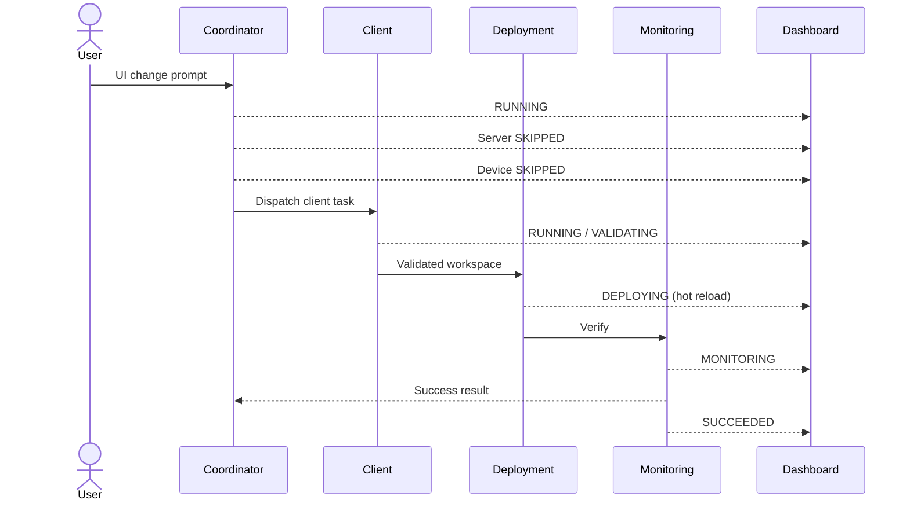

# WireJac Autonomous Agent Graph

## Implementation Blueprint for Embedded Jac Projects

WireJac uses Jac Object-Spatial Programming (OSP) as its orchestration model. The control plane is a persistent Jac graph, project areas are nodes, workflow transitions are typed edge archetypes, and one request walker carries a user change through planning, implementation, deployment, and monitoring.

The first demonstration target is a data-collection application with three project workspaces:

- `client`: a dashboard for visualizing accelerometer training samples.
- `server`: an API that receives and serves accelerometer readings.
- `device`: ESP32 and accelerometer code that sends readings to the server.

The demonstration change is intentionally narrow: a user asks the Coordinator to make a small dashboard UI change. The Coordinator selects only the Client workspace, marks Server and Device as skipped, and the dashboard visualizes this route:

```text
Coordinator -> Client -> Deployment -> Monitoring
```

This design does not use LangGraph or another graph orchestration framework. It uses Jac nodes, edge archetypes, node abilities, walkers, graph traversal, and persistent graph state directly.

## Status of the Design

The architecture distinguishes proven Jac behavior from WireJac features that still need implementation.

| Area | Status | Meaning |
| --- | --- | --- |
| Jac nodes, edges, walkers, `visit`, `report`, and `disengage` | Supported by Jac | These are the native orchestration primitives. |
| Node entry abilities reacting to a request walker | Supported by Jac | Agent or executor behavior can be attached to graph locations. |
| Explicit traversal through edge archetypes | Supported by Jac | The request walker controls which connected nodes are visited. |
| Persistent WireJac project graph | Planned | The graph schema is defined here but persistence wiring is not implemented in this repository yet. |
| OpenRouter DeepSeek agent loop | Planned | Coordinator and workspace adapters must be implemented. |
| Workspace file and shell tools | Planned | Tools require path containment, allowlists, output limits, and redaction. |
| WireJac live graph dashboard | External work in progress | This document defines the event contract it consumes. |
| Jac-to-Python device pipeline | Partially available | Jac can produce Python, but ESP32 MicroPython compatibility needs a restricted subset and compatibility checks. |
| General Jac-to-MicroPython support | Experimental | Arbitrary Jac, OSP, and Jac runtime features must not be claimed to work on ESP32. |

## Goals

1. Represent the autonomous development workflow as a literal Jac graph.
2. Keep each coding agent inside one project subdirectory.
3. Route only to workspaces affected by the user's request.
4. Make every significant activation visible on the WireJac dashboard.
5. Validate generated changes before deployment.
6. Stop and replan when a local API specification changes.
7. Keep deployment and monitoring deterministic.
8. Require approval immediately before writing firmware to a physical ESP32.
9. Preserve failed edits and snapshots for diagnosis instead of silently discarding work.
10. Keep secrets out of prompts, source files, dashboard events, and logs.

## Non-Goals for the First Demo

- Running the OSP control graph on the ESP32.
- Supporting concurrent user change requests.
- Giving agents unrestricted access to the repository or host shell.
- Allowing agents to flash hardware directly.
- Proving arbitrary Jac code is compatible with MicroPython.
- Building a general-purpose multi-agent framework before the client-only demo works.
- Modeling every LLM turn or tool invocation as a graph node.

## Jac OSP Mapping

The terms in this document have precise meanings.

| Jac construct | WireJac role |
| --- | --- |
| Node | A persistent project location with identity, configuration, and operational state. |
| Node entry ability | Behavior triggered when the request walker enters that location. Agentic nodes call OpenRouter; deterministic nodes run controlled adapters. |
| Walker | One user request and its stateful walk through the project graph. |
| Edge archetype | A named workflow relationship used by explicit traversal queries. |
| Object | Typed non-spatial data such as impact plans, activations, and adapter results. |
| `visit` | An explicit request by the walker to queue the next graph location. |
| `report` | The final result returned by the walker. It is not the primary live-event transport. |
| `disengage` | Immediate termination of the request walk after success or unrecoverable failure. |

Edges do not execute workflows by themselves. They describe legal or meaningful relationships. The request walker must explicitly query and visit the next node. This is important because a connected Client node is not automatically activated just because a `Dispatch` edge exists.

## System Boundary

The Jac graph runs on the development computer. The generated web application and server also run on this computer for the demo. The ESP32 remains a peripheral deployment target.



The model never receives deployment credentials, Wi-Fi secrets, API keys, or unrestricted serial access. Those values are injected into deterministic adapters only when needed.

## Persistent Six-Node Topology

The project graph contains six operational nodes.

| Node | Agentic | Workspace | Responsibility |
| --- | --- | --- | --- |
| Coordinator | Yes | Project-level context only | Interpret the prompt, reconcile API specs, produce a typed impact plan, and choose affected workspaces. |
| Client | Yes | `workspace/client` | Modify and validate dashboard code. |
| Server | Yes | `workspace/server` | Modify and validate the accelerometer API and data service. |
| Device | Yes | `workspace/device` | Modify restricted Jac device source, produce Python, run compatibility checks, and prepare a flashable artifact. |
| Deployment | No | None | Execute allowlisted release actions, enforce approval, and record results. |
| Monitoring | No | None | Normalize health checks, browser errors, process logs, HTTP failures, and serial observations. |



The graph topology is persistent across requests. A request does not create another set of Client, Server, and Device nodes. The request walker carries run-specific state while the nodes retain project identity and configuration.

## Workflow Edge Archetypes

Only workflow relationships are graph edges in the first implementation. Software architecture dependencies remain in each workspace's API specification.

| Edge | Source | Target | Meaning |
| --- | --- | --- | --- |
| `Dispatch` | Coordinator | Client, Server, or Device | Coordinator may assign work to this workspace. |
| `ReadyToDeploy` | Workspace | Deployment | A selected workspace can hand validated output to Deployment. |
| `Verify` | Deployment | Monitoring | Deployment output must be checked before the request succeeds. |
| `Feedback` | Monitoring | Coordinator | A runtime or acceptance failure requires replanning. |

The current validated Jac skeleton uses typed edge archetypes plus explicit node filters, such as `[here ->:Dispatch:->][?:Workspace]`. This keeps traversal statically understandable without requiring edge endpoint syntax from a newer compiler release.

## Request Walker

One `ChangeRequest` walker represents one user request. The walker is both the execution token and the minimal run record.

It carries:

- The original user prompt.
- The current typed impact plan.
- Compact activation records for the dashboard.
- Results returned by selected workspace agents.
- The set of completed workspaces.
- Replan count and retry bounds.
- Deployment outcome.
- Monitoring outcome.
- Final success or failure state.

The first demo supports one request at a time. Queuing and concurrent request conflict resolution are explicitly out of scope.

### Why the Node Invokes the Agent

The Coordinator, Client, Server, and Device nodes own their agent behavior through node entry abilities. The walker owns routing.

Jac event ordering matters:

1. A walker's entry ability runs when it reaches the node.
2. The node's entry ability then reacts to the visiting walker.
3. Node exit behavior runs.
4. The walker's exit ability can inspect the result and queue the next visit.

WireJac therefore performs the side effect in the node entry ability and makes the routing decision in the walker exit ability. This avoids routing before an agent result exists.

## Impact Plan Contract

The Coordinator must produce structured data before any workspace agent runs.

```json
{
  "selected": ["client"],
  "skipped": {
    "server": "The request does not change API behavior or server rendering.",
    "device": "The request does not change sampling or upload behavior."
  },
  "tasks": {
    "client": "Increase chart contrast and make the active sample count more prominent."
  },
  "acceptance": [
    "The accelerometer chart uses the requested visual treatment.",
    "The active sample count is visible without opening another panel.",
    "No new browser-console errors are emitted."
  ],
  "contract_change_expected": false,
  "deployment_intent": "hot_reload"
}
```

The Coordinator must not return only a free-form rewritten prompt. A workspace agent receives a bounded task derived from this plan.

### Coordinator Rules

1. Read the user prompt.
2. Read the API specs from Client, Server, and Device.
3. Compare spec version and contract identifiers.
4. Identify affected workspaces.
5. State why every unselected workspace is skipped.
6. Define observable acceptance criteria.
7. Identify whether a contract change is expected.
8. Select a deployment intent.
9. Reject a plan that selects no workspace unless the request is informational.
10. Emit `PLANNED`, `SKIPPED`, and `QUEUED` lifecycle events.

## Activation Lifecycle

The graph and dashboard use one finite lifecycle vocabulary.

| State | Meaning |
| --- | --- |
| `PLANNED` | Coordinator has included the node in the impact decision. |
| `QUEUED` | The walker has queued the node for a visit. |
| `RUNNING` | An agent or deterministic action is executing. |
| `REPAIRING` | A workspace agent is using validation feedback for another bounded attempt. |
| `REPLANNING` | Control is returning to Coordinator due to contract drift or monitoring failure. |
| `AWAITING_APPROVAL` | Deployment is paused immediately before a physical flash operation. |
| `VALIDATING` | Deterministic checks are running. |
| `DEPLOYING` | A deterministic release action is running. |
| `MONITORING` | Health, acceptance, and runtime-error checks are running. |
| `SKIPPED` | Coordinator determined the workspace is unaffected. No model call occurs there. |
| `SUCCEEDED` | The node completed its responsibilities. |
| `FAILED` | The node exhausted its allowed recovery policy or hit a non-recoverable error. |
| `CANCELLED` | Reserved for a future cancellation feature. The first demo does not expose cancellation. |

An activation stores only dashboard and audit essentials:

- Request ID.
- Node name.
- State.
- Start and finish timestamps.
- Human-readable summary.
- Tool-call count.
- Validation outcome.
- Snapshot or generated revision identifier.
- Redacted error summary.

Full model reasoning must not be stored or displayed. Tool inputs and outputs may contain secrets or large source files and should not be copied into compact activation events.

## Workspace Node Contract

Client, Server, and Device inherit from a common `Workspace` node shape.

| Field | Purpose |
| --- | --- |
| `name` | Stable route and dashboard identifier. |
| `kind` | Client, Server, or Device role. |
| `path` | Canonical workspace root. All tools are confined here. |
| `skill_path` | Role instructions loaded into the model context. |
| `spec_path` | Local API specification visible to the agent. |
| `snapshot_path` | Filesystem snapshot captured before mutation. |
| Validation commands | Role-specific allowlisted checks configured outside model output. |
| Runtime log source | Adapter configuration used by Monitoring. |

### Required Role Files

Each workspace has one concise role file:

- `workspace/client/client.md`
- `workspace/server/server.md`
- `workspace/device/device.md`

Every role file defines:

1. The workspace's responsibility.
2. Which files it may modify.
3. Commands it may request.
4. Required validation checks.
5. How to read and update `api-spec.md`.
6. Conditions that require returning to Coordinator.
7. Forbidden operations.
8. Completion evidence expected from the agent.

The Device role must explicitly describe the restricted Jac-to-Python-to-MicroPython process. It must not claim that arbitrary Jac or OSP source can run on ESP32.

## Per-Workspace API Specifications

Each workspace has its own `api-spec.md`. Agents are allowed to read it. The specification records the interfaces that cross workspace boundaries, not implementation details internal to one workspace.

A minimal specification should contain:

```markdown
# Accelerometer API Contract

Contract-Version: 3
Contract-ID: accelerometer-samples-v3
Content-Hash: <computed by coordinator>

## Device to Server

POST /api/samples
Content-Type: application/json

Request fields:
- device_id: string
- captured_at_ms: integer
- x: number
- y: number
- z: number
- label: string | null

Response:
- accepted: boolean
- sample_id: string

## Server to Client

GET /api/samples?session_id=<id>

Response fields:
- session_id: string
- samples: array of accelerometer samples
```

### Reconciliation Policy

There is no seventh Contract graph node in the first topology. Contract truth is represented by synchronized workspace files and Coordinator reconciliation.

1. Coordinator reads all three specs before planning.
2. Coordinator computes normalized content hashes and compares contract versions.
3. A mismatch blocks ordinary workspace execution until reconciled.
4. A workspace agent may edit its local spec when its implementation requires a contract change.
5. The agent must set `contract_changed=true` in its structured result.
6. The current route stops before Deployment.
7. The walker follows the incoming `Dispatch` relation back to Coordinator.
8. Coordinator reevaluates affected workspaces and acceptance criteria.
9. Coordinator propagates the approved contract revision to affected spec files.
10. The expanded plan activates every workspace needed to implement the new contract.

For the client-only UI demonstration, the Client agent should not alter its spec. If it does, the expected route is a replan, not a client-only deployment.

## Workspace Agent Context

An agent starts with a bounded context bundle rather than the entire repository.

| Context item | Source |
| --- | --- |
| User goal | `ChangeRequest.prompt` |
| Workspace task | `ImpactPlan.tasks[workspace.name]` |
| Acceptance criteria | `ImpactPlan.acceptance` |
| Role instructions | Workspace role file |
| API contract | Workspace `api-spec.md` |
| Directory overview | Bounded tree listing under workspace root |
| Relevant source | Files selected by Coordinator or discovered with tools |
| Allowed commands | Deterministic workspace configuration |
| Repair feedback | Most recent formatter, compiler, test, or runtime failure |

Secrets are never part of this bundle. Values such as `OPENROUTER_API_KEY`, Wi-Fi credentials, serial ports, and deployment tokens remain opaque references resolved by host adapters.

## OpenRouter DeepSeek Agent Loop

Coordinator and workspace agents call a DeepSeek model through OpenRouter. The exact model ID and generation parameters remain configuration, not graph schema. WireJac should expose a model adapter with the following responsibilities:

- Add the role and bounded context.
- Send OpenAI-compatible chat and tool definitions to OpenRouter.
- Enforce request timeouts and bounded provider retries.
- Validate structured final output.
- Count tool turns.
- Redact secrets and sensitive paths from errors.
- Distinguish provider failure from workspace validation failure.

### Coordinator Tools

The Coordinator needs read-only planning tools plus controlled spec reconciliation:

| Tool | Permission |
| --- | --- |
| Read workspace role file | Read-only |
| Read workspace API spec | Read-only during ordinary planning |
| Read bounded workspace tree | Read-only |
| Compare contract hashes | Deterministic |
| Propose impact plan | Structured output |
| Reconcile approved specs | Controlled write during replan |

### Workspace Tools

| Tool | Behavior |
| --- | --- |
| `read_file` | Read a file after canonical-path containment validation. |
| `glob_files` | List matching files under the workspace root only. |
| `search_text` | Search bounded workspace content. |
| `apply_patch` | Apply a structured patch only inside the workspace. |
| `write_file` | Write or replace a workspace file after containment and size checks. |
| `run_command` | Execute an allowlisted command with the workspace as current directory. |
| `read_validation` | Return normalized formatter, compiler, test, or build output. |

### Tool Security Invariants

1. Resolve and normalize every path before access.
2. Reject paths escaping the workspace through `..`, absolute paths, or symlinks.
3. Do not let the model choose the shell executable.
4. Match requested commands against role-specific executable and argument policies.
5. Set working directory to the workspace root.
6. Apply command timeout, output-size, and process-count limits.
7. Deny network tools unless explicitly required by that role.
8. Never expose host environment variables to the model.
9. Redact known secret patterns before recording logs or events.
10. Do not allow Client, Server, or Device agents to invoke flashing tools.

### Bounded Repair Algorithm

```text
snapshot workspace
build bounded context

for attempt in 1..MAX_ATTEMPTS:
    publish RUNNING or REPAIRING
    call OpenRouter DeepSeek with available tools
    validate the structured completion result
    run deterministic role checks

    if checks pass:
        detect whether api-spec.md changed
        return successful AgentResult

    normalize validation errors
    add bounded error feedback to the next attempt

return failed AgentResult without deploying
```

Retries are bounded. There is no "loop until compilation passes" behavior. Exhaustion preserves the snapshot, attempted files, validation output, and compact activation history for diagnosis.

## Filesystem Snapshots

Before an agent receives a write-capable tool, WireJac creates a snapshot of that workspace.

Suggested location:

```text
runtime/snapshots/<request-id>/<workspace-name>/
```

The snapshot record includes:

- Request ID.
- Workspace name.
- Timestamp.
- Source path.
- Snapshot path.
- Pre-change content manifest and hashes.
- Post-change content manifest and hashes when successful.

WireJac does not automatically restore a failed attempt in the first implementation. It preserves both the pre-change snapshot and attempted workspace so the user can inspect the failure. Automatic rollback can be added later as an explicit policy.

## Deterministic Deployment

Deployment is a node, but it is not an LLM agent. Its entry ability calls deterministic adapters selected by `deployment_intent` and the completed workspace set.

| Selected workspace | Deployment behavior |
| --- | --- |
| Client | Confirm the development server is active and let its existing hot reload consume validated files. Do not start another server. |
| Server | Run the configured restart or reload adapter only after server validation. |
| Device | Build and check generated Python, prepare the board operation, then pause before physical flash. |

### Physical Flash Gate

The Device agent may generate and validate source, but it cannot write to a board.

```text
Device succeeds
  -> Deployment validates artifact and identifies target board
  -> activation becomes AWAITING_APPROVAL
  -> user approves exact port, board, artifact hash, and command
  -> deterministic adapter invokes MicroPython tooling
  -> activation becomes DEPLOYING
```

Approval is specific to one request, artifact hash, device target, and command. It must not become a permanent global permission.

## Device Source Pipeline

The intended device sequence is:

```text
restricted device Jac source
    -> Jac-to-Python output
    -> MicroPython compatibility checks
    -> board-ready Python files
    -> explicit approval
    -> MicroPython copy/flash tooling
    -> serial and upload monitoring
```

### Required Technical Qualification

Jac-to-Python output is not automatically MicroPython-compatible. Generated Python can depend on the standard Python runtime or Jac runtime modules unavailable on ESP32. Until the external pipeline proves otherwise, Device source must use a deliberately restricted subset.

The compatibility gate should reject at least:

- OSP nodes, edges, walkers, and persistence in device-targeted source.
- `by llm` and host network model integrations.
- Jac runtime imports unavailable on MicroPython.
- Python standard-library modules absent from the target firmware.
- Dynamic features unsupported by the chosen MicroPython build.
- Files exceeding configured device memory limits.
- Hardware imports not declared by the Device role.

The first milestone should prove a generated blink program. The next milestone should prove accelerometer reads and HTTP sample upload. Only then should the demo describe the pipeline as working for the data collector.

## Deterministic Monitoring

Monitoring consumes normalized observations from adapters. It does not ask an LLM whether the deployment looks healthy.

| Adapter | Observations |
| --- | --- |
| Browser | Page-load result, target element assertion, browser-console errors, unhandled promise rejections. |
| Client process | Hot-reload completion and build/runtime errors. |
| Server process | Startup state, request exceptions, schema errors, and recent process logs. |
| HTTP | Health status, latency, response shape, and sample endpoint behavior. |
| Serial | ESP32 boot output, exceptions, reset loops, upload acknowledgements, and sensor status. |

For the client-only demo, Monitoring requires:

1. The client development server remains healthy.
2. Hot reload observes the modified files.
3. The dashboard loads.
4. The requested UI assertion passes.
5. No new browser-console error appears.
6. No new workspace runtime error is observed.

If any required check fails, Monitoring emits a failed activation and the walker follows `Feedback` to Coordinator. Coordinator may produce a bounded repair plan. Once the replan limit is exhausted, the walker reports failure and stops.

## Dashboard Event Contract

The WireJac dashboard receives compact lifecycle events in real time. Server-Sent Events are the simplest default because events are primarily one-way. A WebSocket transport may implement the same payload contract. The dashboard also needs a snapshot endpoint so reconnecting clients can recover current state.

### Event Shape

```json
{
  "event_version": 1,
  "request_id": "req-2026-07-26-001",
  "sequence": 7,
  "node": "client",
  "state": "validating",
  "summary": "Running client type and build checks",
  "started_at": "2026-07-26T18:42:10Z",
  "finished_at": null,
  "tool_count": 5,
  "revision": "snapshot:req-2026-07-26-001/client:after",
  "validation": {
    "passed": null,
    "check": "client-build"
  },
  "error": null
}
```

### Event Rules

1. `sequence` increases monotonically per request.
2. Every selected node receives at least `QUEUED`, `RUNNING`, and one terminal event.
3. Every skipped workspace receives one `SKIPPED` event with a reason and no model call.
4. Events are emitted after graph state changes so snapshot recovery cannot move backward.
5. Event publication failure does not authorize duplicate side effects.
6. The event sink redacts secrets before serialization.
7. Long command output and model messages are referenced, not embedded.

### Suggested Dashboard Rendering

- Keep all six project nodes visible.
- Animate only traversed workflow edges.
- Color Server and Device as skipped during the UI demo.
- Show compact status, duration, tool count, and validation result in a node detail panel.
- Display replans as a visible `Monitoring -> Coordinator` or `Workspace -> Coordinator` return path.
- Do not render hidden model reasoning.

## Client-Only Demonstration Trace

Example user prompt:

> Make the accelerometer chart easier to read and show the active sample count more prominently. Do not change data collection or API behavior.

Expected execution:

1. The request walker is spawned on Coordinator.
2. Coordinator publishes `RUNNING`.
3. Coordinator reads all workspace API specs and relevant role context.
4. OpenRouter DeepSeek returns a typed impact plan selecting Client.
5. Coordinator records Server as `SKIPPED`: no API or server behavior change.
6. Coordinator records Device as `SKIPPED`: no sampling, firmware, or upload change.
7. Coordinator queues Client through `Dispatch`.
8. Client creates a filesystem snapshot.
9. Client loads `client.md`, `api-spec.md`, its task, acceptance criteria, and relevant source.
10. Client's bounded agent loop inspects and edits only `workspace/client`.
11. Deterministic formatter, type, test, and build checks run.
12. If validation fails, Client enters `REPAIRING` and receives normalized feedback.
13. If the Client spec changed, Client reports `contract_changed=true` and the walker returns to Coordinator instead of deploying.
14. If validation succeeds without contract drift, Client reports `SUCCEEDED`.
15. The walker follows `ReadyToDeploy` to Deployment.
16. Deployment confirms the existing development server will hot reload the validated change.
17. The walker follows `Verify` to Monitoring.
18. Monitoring loads the dashboard, checks the requested UI, inspects browser-console output, and checks workspace runtime errors.
19. Monitoring reports `SUCCEEDED`.
20. The walker reports its compact activation list and disengages.

Expected dashboard route:



## Success Definition

The request is complete only when all of the following are true:

- Coordinator produced a valid impact plan.
- Every selected workspace passed its configured checks.
- No selected workspace has an unresolved API spec change.
- Deployment completed its deterministic action.
- Hot reload or the relevant release mechanism observed the change.
- Every acceptance criterion passed.
- No new runtime errors were detected.
- The final activation event was published or retained for later publication.

An agent saying "done" is not success evidence.

## Failure and Recovery Matrix

| Failure | Owner | Recovery | Terminal behavior |
| --- | --- | --- | --- |
| OpenRouter timeout | Current agent node | Bounded provider retry with backoff | Fail node after retry limit. |
| Invalid Coordinator output | Coordinator | Request corrected structured output | Stop before workspace mutation if still invalid. |
| Workspace tool request denied | Workspace | Return policy error to model | Fail after bounded repair attempts. |
| Formatter/compiler/test failure | Workspace | Local bounded repair | Preserve attempted files and snapshot if exhausted. |
| API spec changed | Workspace and Coordinator | Stop route, replan, reconcile specs, expand affected nodes | Never deploy stale dependents. |
| Client hot reload failure | Deployment or Monitoring | Feedback to Coordinator | Stop after replan bound. |
| UI acceptance failure | Monitoring | Feedback to Coordinator with normalized observation | Stop after replan bound. |
| New runtime error | Monitoring | Feedback to Coordinator | Stop after replan bound. |
| ESP32 approval denied | Deployment | Preserve prepared artifact | Report denied deployment without flashing. |
| ESP32 flash failure | Deployment | No agent retry of hardware write without policy | Preserve command output and artifact hash. |
| Event stream unavailable | Event adapter | Buffer compact events and expose snapshot | Do not repeat model, file, deploy, or flash side effects. |

## Validated Jac Architecture Skeleton

The following skeleton has been checked with the Jac full validator. It illustrates the graph contracts; the runnable implementation uses the bounded OpenRouter, workspace, deployment, monitoring, and event adapters described above.

```jac
enum ActivationState {
    PLANNED = "planned",
    QUEUED = "queued",
    RUNNING = "running",
    REPAIRING = "repairing",
    REPLANNING = "replanning",
    AWAITING_APPROVAL = "awaiting_approval",
    VALIDATING = "validating",
    DEPLOYING = "deploying",
    MONITORING = "monitoring",
    SKIPPED = "skipped",
    SUCCEEDED = "succeeded",
    FAILED = "failed",
    CANCELLED = "cancelled"
}

enum WorkspaceKind {
    CLIENT = "client",
    SERVER = "server",
    DEVICE = "device"
}

obj Activation {
    has node_name: str,
        state: ActivationState,
        summary: str = "",
        started_at: str = "",
        finished_at: str = "",
        tool_count: int = 0,
        revision: str = "",
        error: str = "";
}

obj ImpactPlan {
    has selected: list[str] = [],
        skipped: dict[str, str] = {},
        tasks: dict[str, str] = {},
        acceptance: list[str] = [],
        contract_change_expected: bool = False,
        deployment_intent: str = "hot_reload";
}

obj AgentResult {
    has success: bool = False,
        summary: str = "",
        tool_count: int = 0,
        revision: str = "",
        contract_changed: bool = False,
        error: str = "";
}

obj MonitorResult {
    has success: bool = False,
        summary: str = "",
        errors: list[str] = [];
}

node Coordinator {
    has name: str = "coordinator",
        max_replans: int = 2;

    can invoke_planner with ChangeRequest entry {
        visitor.record(self.name, ActivationState.RUNNING, "Planning impact");
        visitor.completed = [];
        visitor.failed = False;
        visitor.plan = plan_change(visitor.prompt);
        for name in visitor.plan.selected {
            visitor.record(
                name,
                ActivationState.PLANNED,
                visitor.plan.tasks.get(name, visitor.prompt)
            );
        }
        for (name, reason) in visitor.plan.skipped.items() {
            visitor.record(name, ActivationState.SKIPPED, reason);
        }
        visitor.record(self.name, ActivationState.SUCCEEDED, "Impact plan ready");
    }
}

node Workspace {
    has name: str,
        kind: WorkspaceKind,
        path: str,
        skill_path: str,
        spec_path: str,
        snapshot_path: str = "";

    can invoke_workspace_agent with ChangeRequest entry {
        visitor.record(
            self.name,
            ActivationState.RUNNING,
            "Running bounded agent loop"
        );
        task = visitor.plan.tasks.get(self.name, visitor.prompt);
        result = run_workspace_agent(
            self.path,
            self.skill_path,
            self.spec_path,
            task
        );
        visitor.results[self.name] = result;
        if result.success {
            visitor.completed.append(self.name);
            visitor.record(
                self.name,
                ActivationState.SUCCEEDED,
                result.summary,
                result.tool_count,
                result.revision
            );
        } else {
            visitor.failed = True;
            visitor.record(
                self.name,
                ActivationState.FAILED,
                result.summary,
                result.tool_count,
                result.revision,
                result.error
            );
        }
    }
}

node Client(Workspace) {}
node Server(Workspace) {}
node Device(Workspace) {}

node Deployment {
    has name: str = "deployment",
        flash_requires_approval: bool = True;

    can execute with ChangeRequest entry {
        visitor.record(
            self.name,
            ActivationState.DEPLOYING,
            "Applying deterministic deployment"
        );
        visitor.deployment_ok = deploy(visitor.plan.deployment_intent);
        visitor.record(
            self.name,
            ActivationState.SUCCEEDED
                if visitor.deployment_ok else ActivationState.FAILED,
            "Deployment ready"
                if visitor.deployment_ok else "Deployment failed"
        );
    }
}

node Monitoring {
    has name: str = "monitoring";

    can observe with ChangeRequest entry {
        visitor.record(
            self.name,
            ActivationState.MONITORING,
            "Checking health and runtime errors"
        );
        visitor.monitor_result = monitor(visitor.plan.acceptance);
        visitor.record(
            self.name,
            ActivationState.SUCCEEDED
                if visitor.monitor_result.success else ActivationState.FAILED,
            visitor.monitor_result.summary
        );
    }
}

edge Dispatch {}
edge ReadyToDeploy {}
edge Verify {}
edge Feedback {}

walker ChangeRequest {
    has prompt: str,
        plan: ImpactPlan = ImpactPlan(),
        activations: list[Activation] = [],
        results: dict[str, AgentResult] = {},
        completed: list[str] = [],
        replan_count: int = 0,
        failed: bool = False,
        deployment_ok: bool = False,
        monitor_result: MonitorResult = MonitorResult();

    def record(
        node_name: str,
        state: ActivationState,
        summary: str = "",
        tool_count: int = 0,
        revision: str = "",
        error: str = ""
    ) {
        self.activations.append(Activation(
            node_name=node_name,
            state=state,
            summary=summary,
            tool_count=tool_count,
            revision=revision,
            error=error
        ));
        emit_activation(self.activations[-1]);
    }

    can route_plan with Coordinator exit {
        if self.replan_count > here.max_replans {
            self.failed = True;
            report self.activations;
            disengage;
        }
        for workspace in [here ->:Dispatch:->][?:Workspace] {
            if workspace.name in self.plan.selected {
                self.record(
                    workspace.name,
                    ActivationState.QUEUED,
                    "Selected by Coordinator"
                );
                visit workspace;
            }
        }
    }

    can route_workspace with Workspace exit {
        result = self.results.get(here.name);
        if result and result.contract_changed {
            self.replan_count += 1;
            self.record(
                here.name,
                ActivationState.REPLANNING,
                "Local API spec changed"
            );
            visit [here <-:Dispatch:<-][?:Coordinator];
        } elif self.failed {
            report self.activations;
            disengage;
        } elif len(self.completed) == len(self.plan.selected) {
            visit [here ->:ReadyToDeploy:->][?:Deployment];
        }
    }

    can route_deployment with Deployment exit {
        if not self.deployment_ok {
            self.failed = True;
            report self.activations;
            disengage;
        }
        visit [here ->:Verify:->][?:Monitoring];
    }

    can route_monitoring with Monitoring exit {
        if self.monitor_result.success {
            report self.activations;
            disengage;
        }
        self.replan_count += 1;
        self.record(
            here.name,
            ActivationState.REPLANNING,
            "Monitoring requested repair"
        );
        visit [here ->:Feedback:->][?:Coordinator];
    }
}

# Illustrative adapters keep this architecture reference self-contained.
def plan_change(prompt: str) -> ImpactPlan {
    return ImpactPlan(
        selected=["client"],
        skipped={
            "server": "No API change",
            "device": "No firmware change"
        },
        tasks={"client": prompt},
        acceptance=["Requested dashboard UI is visible"]
    );
}

def run_workspace_agent(
    path: str,
    skill_path: str,
    spec_path: str,
    task: str
) -> AgentResult {
    return AgentResult(
        success=True,
        summary=(
            f"Validated {task} in {path} using "
            f"{skill_path} and {spec_path}"
        ),
        tool_count=1
    );
}

def deploy(intent: str) -> bool {
    return intent == "hot_reload";
}

def monitor(acceptance: list[str]) -> MonitorResult {
    return MonitorResult(
        success=True,
        summary=f"Passed {len(acceptance)} checks"
    );
}

def emit_activation(event: Activation) {
    print(event);
}
```

## Validated Graph Bootstrap Pattern

The graph should be created once for a project, not recreated for every prompt. This standalone construction pattern also passes Jac validation.

```jac
with entry {
    coordinator = root() ++> Coordinator();
    client = Client(
        name="client",
        kind=WorkspaceKind.CLIENT,
        path="workspace/client",
        skill_path="workspace/client/client.md",
        spec_path="workspace/client/api-spec.md"
    );
    server = Server(
        name="server",
        kind=WorkspaceKind.SERVER,
        path="workspace/server",
        skill_path="workspace/server/server.md",
        spec_path="workspace/server/api-spec.md"
    );
    device = Device(
        name="device",
        kind=WorkspaceKind.DEVICE,
        path="workspace/device",
        skill_path="workspace/device/device.md",
        spec_path="workspace/device/api-spec.md"
    );
    deployment = Deployment();
    monitoring = Monitoring();

    coordinator +>:Dispatch():+> [client, server, device];
    [client, server, device] +>:ReadyToDeploy():+> deployment;
    deployment +>:Verify():+> monitoring;
    monitoring +>:Feedback():+> coordinator;

    coordinator spawn ChangeRequest(
        prompt="Make the chart easier to read"
    );
}
```

In production, graph initialization needs a find-or-create guard so restarting the host does not create duplicate project nodes and edges.

## Proposed Repository Layout

```text
.
|-- main.jac
|-- orchestrator/
|   |-- graph.jac
|   |-- models.jac
|   |-- agents.jac
|   |-- tools.jac
|   |-- deployment.jac
|   |-- monitoring.jac
|   |-- events.jac
|   `-- impl/
|       |-- agents.impl.jac
|       |-- tools.impl.jac
|       |-- deployment.impl.jac
|       |-- monitoring.impl.jac
|       `-- events.impl.jac
|-- workspace/
|   |-- client/
|   |   |-- client.md
|   |   |-- api-spec.md
|   |   `-- <WireJac client project>
|   |-- server/
|   |   |-- server.md
|   |   |-- api-spec.md
|   |   `-- <WireJac server project>
|   `-- device/
|       |-- device.md
|       |-- api-spec.md
|       |-- src/
|       |   `-- main.jac
|       `-- generated/
|           `-- main.py
|-- config/
|   `-- wirejac.toml
`-- runtime/
    |-- snapshots/
    |-- events/
    `-- logs/
```

Declaration files should expose node, walker, object, adapter, and event contracts. Substantial implementations should live in matching `impl/*.impl.jac` files so the architecture remains readable without model, file-system, subprocess, or monitoring details.

## Configuration Responsibilities

`wirejac.toml` or an equivalent host configuration should define operational values rather than embedding them in graph state or prompts.

```toml
[model]
provider = "openrouter"
model = "<configured-deepseek-model-id>"
api_key_env = "OPENROUTER_API_KEY"

[workspace.client]
path = "workspace/client"
skill = "workspace/client/client.md"
spec = "workspace/client/api-spec.md"
validate = ["<client-format-command>", "<client-build-command>"]

[workspace.server]
path = "workspace/server"
skill = "workspace/server/server.md"
spec = "workspace/server/api-spec.md"
validate = ["<server-test-command>"]

[workspace.device]
path = "workspace/device"
skill = "workspace/device/device.md"
spec = "workspace/device/api-spec.md"
validate = ["<jac-check-command>", "<micropython-compat-command>"]

[policy]
max_agent_attempts = 3
max_replans = 2
flash_requires_approval = true
concurrent_requests = 1
```

The document intentionally does not hard-code a DeepSeek model ID or demo commands while the external WireJac components are still under development.

## Implementation Milestones

### Milestone 1: Native Graph

- Split the validated skeleton into declaration and implementation modules.
- Build the persistent six-node topology with find-or-create behavior.
- Spawn a client-only request walker.
- Verify Server and Device are not visited.
- Emit lifecycle events to a test event sink.
- Add Jac tests for success, failure, replan, and traversal bounds.

### Milestone 2: Dashboard Contract

- Assign request IDs and monotonic event sequences.
- Implement the compact event store.
- Expose graph snapshot and SSE event endpoints.
- Connect the external WireJac dashboard.
- Animate the client-only route and skipped nodes.

### Milestone 3: Coordinator

- Implement OpenRouter DeepSeek adapter.
- Load bounded role and API-spec context.
- Validate structured impact plans.
- Implement spec hashing and mismatch detection.
- Test malicious and ambiguous prompts against routing policy.

### Milestone 4: Client Agent

- Implement contained read, search, patch, write, and command tools.
- Add filesystem snapshots.
- Add bounded repair attempts.
- Connect actual client validation commands.
- Complete the hot-reload UI-change demonstration.

### Milestone 5: Monitoring

- Add browser load and UI assertion adapter.
- Capture browser-console errors.
- Normalize client and server runtime logs.
- Implement Monitoring feedback to Coordinator.

### Milestone 6: Contract Replanning

- Detect local `api-spec.md` edits.
- Return from Workspace to Coordinator before Deployment.
- Reconcile versions and hashes.
- Expand plans to Server and Device where required.
- Test stale-contract deployment prevention.

### Milestone 7: Device Pipeline

- Define the allowed device-targeted Jac subset.
- Prove blink through Jac-to-Python and MicroPython tooling.
- Add compatibility checks and artifact manifests.
- Prove accelerometer sampling and HTTP upload.
- Add serial monitoring.
- Add artifact-specific flash approval.

## Demo Checklist

- All six graph nodes are visible before the request starts.
- The accelerometer dashboard is already running locally.
- A client UI prompt is submitted to Coordinator.
- Coordinator, Client, Deployment, and Monitoring animate in order.
- Server and Device visibly show `SKIPPED` with reasons.
- Client source changes only under `workspace/client`.
- Client API spec remains unchanged.
- Validation passes before Deployment.
- Existing hot reload displays the change.
- Monitoring verifies the requested UI and clean runtime.
- The final request result contains the compact activation history.
- No API keys, environment values, or unrestricted command output appears in the dashboard.

## Core Architectural Claim

WireJac is not using a graph as a diagram placed on top of an agent harness. The project topology is a Jac graph, project state lives at graph locations, a user request is a Jac walker, agent behavior is triggered by node entry, and routing is performed with explicit Jac traversal. File edits, model calls, deployment, and monitoring remain controlled side effects behind typed graph behavior.

That is the Jac-native contribution: OSP is the control plane rather than an incidental data model, while the ESP32 remains an appropriately constrained embedded deployment target.
